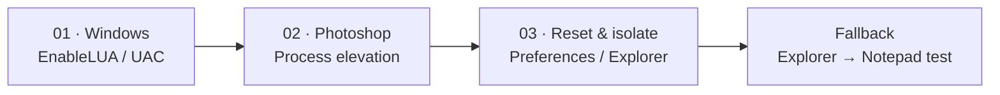

<p align="center">
  
</p>

<h1 align="center">Photoshop Drag & Drop Fix</h1>

<p align="center">
  <strong>Fix “Photoshop drag and drop not working” on Windows 10/11 with a safe 3-step diagnostic decision tree.</strong>
</p>

<p align="center">
  <sub>Diagnose-only by design · No silent registry edits · No automatic restarts · Every system change requires explicit authorization.</sub>
</p>

<p align="center">
  
  
  
  <a href="./LICENSE"></a>
</p>

<p align="center">
  <a href="#does-this-match-your-issue">Is this your issue?</a>
  ·
  <a href="#how-it-works">How it works</a>
  ·
  <a href="#quick-start">Install</a>
  ·
  <a href="#example-session">Example</a>
  ·
  <a href="#evidence--references">Evidence</a>
  ·
  <a href="#faq">FAQ</a>
  ·
  <a href="./README.zh-CN.md">简体中文</a>
</p>

---

## Does this match your issue?

This skill is designed for the common Windows case where **Photoshop opens normally, but files dragged from File Explorer no longer drop into the Photoshop canvas**.

It is a strong match when:

- Photoshop worked normally before, then drag-and-drop suddenly stopped.
- JPG / PNG / TIFF files open normally, but dragging them from File Explorer into Photoshop does nothing.
- You are using **Windows 10 or Windows 11** with **Photoshop 2026 (27.x)**.
- You want to **diagnose the cause before changing system settings**.

> **Not a general Photoshop repair tool.**  
> It does not troubleshoot activation, crashes, performance, missing plugins, or unrelated Adobe applications.

---

## How it works

The skill moves from the safest, highest-signal checks to more disruptive fallback steps.



| Step | What it checks | Why it matters | Change risk |
|---|---|---|---|
| **01 · Windows** | `EnableLUA` / UAC state | Drag-and-drop can fail when Windows integrity / elevation behavior is altered | Low |
| **02 · Photoshop** | Photoshop executable and shortcut elevation | A privilege-level mismatch can block drag-and-drop between processes | Low |
| **03 · Reset & isolate** | Photoshop preferences + Windows Explorer | Separates app-state problems from Windows drag-layer problems | Medium |
| **Fallback** | Explorer → Notepad three-way drag test | Helps isolate whether Windows or Photoshop is the receiver-side failure | None |

The skill **stops before every change** and asks for authorization.

---

## Quick Start

### 1. Install the skill

Copy the entire repository folder into the skills directory used by your agent:

| Agent | Path |
|---|---|
| **OpenCode / Codex / general** | `~/.agents/skills/photoshop-drag-drop-fix/` |
| **Claude Code** | `~/.claude/skills/photoshop-drag-drop-fix/` |
| **Cursor / other** | `~/.opencode/skills/photoshop-drag-drop-fix/` |

The skill loads automatically on the next session.

### 2. Describe the symptom naturally

```text
Photoshop drag and drop is not working on Windows 11.
Files open normally, but dragging a JPG from Explorer into Photoshop does nothing.
Diagnose it without changing anything automatically.
```

You can also use shorter prompts such as:

```text
Photoshop won't accept drops.
```

```text
PS can't drag files from Explorer.
```

```text
Photoshop 拖不进去图片，帮我先诊断，不要自动修改系统。
```

---

## Example Session

```text
You:
Photoshop suddenly stopped accepting files dragged from Explorer.

Agent:
I'll diagnose the drag-and-drop path without making system changes.

Step 1/3 — Check Windows UAC / EnableLUA
Result: EnableLUA = 0

A likely cause has been found.

Recommended change:
EnableLUA: 0 → 1
A Windows restart is required for the change to take effect.

Apply this change? [Yes / No]
```

The important behavior is the last line: **diagnosis and remediation are separate actions**.

---

## Detailed Diagnosis

<details>
<summary><strong>01 · Windows — EnableLUA / UAC</strong></summary>

The first check inspects:

```text
HKEY_LOCAL_MACHINE\SOFTWARE\Microsoft\Windows\CurrentVersion\Policies\System
EnableLUA
```

Expected state:

```text
EnableLUA = 1
```

If the value is `0`, the skill reports the finding and can recommend changing it to `1`.

It does **not** make that registry change silently.

A restart is required after changing `EnableLUA`.

Microsoft documents `EnableLUA=1` as the default UAC configuration and does not recommend disabling it.

</details>

<details>
<summary><strong>02 · Photoshop — Process Elevation</strong></summary>

The second check looks for Photoshop being launched at a different privilege level from File Explorer.

Typical places to inspect:

- `Photoshop.exe`
- Photoshop shortcut properties
- Taskbar-pinned shortcut compatibility settings
- **Run this program as an administrator**

If Photoshop is forced to run elevated while Explorer is not, drag-and-drop can be blocked by Windows process-integrity boundaries.

The skill reports the state first and asks before suggesting a compatibility-setting change.

</details>

<details>
<summary><strong>03 · Photoshop Preferences + Explorer</strong></summary>

If the first two checks do not explain the failure, the skill moves to application-state and shell-state checks.

Possible actions include:

- Reset Photoshop preferences using `Ctrl + Alt + Shift` during launch.
- Restart Windows Explorer.
- Retest drag-and-drop.

This is treated as a **higher-impact step** because resetting Photoshop preferences can remove user customizations.

Back up important Photoshop preferences before proceeding.

</details>

<details>
<summary><strong>Fallback · Explorer → Notepad Isolation Test</strong></summary>

If all three checks pass and Photoshop still rejects drops, the skill uses a three-way drag test to isolate the failing layer.

The goal is to determine whether:

1. Windows drag-and-drop is failing generally, or
2. Photoshop is specifically failing as the drop receiver.

This keeps the troubleshooting tree focused instead of escalating blindly.

</details>

---

## Scope

<table>
<tr>
<th width="50%">Supported</th>
<th width="50%">Not supported</th>
</tr>
<tr>
<td valign="top">

- Windows 10 / 11
- Photoshop 2026 (27.x) desktop
- File Explorer → Photoshop canvas drag failures
- JPG / PNG / TIFF drag tests
- “It worked before and suddenly stopped” cases
- Diagnose-first workflows

</td>
<td valign="top">

- macOS
- Illustrator / InDesign / Premiere / After Effects
- Photoshop installation or activation
- Photoshop crashes or performance tuning
- General Windows drag-and-drop failures unrelated to Photoshop
- RAW / HEIF plugin or format compatibility problems

</td>
</tr>
</table>

---

## Safety Model

### Diagnose first

The skill checks the system state before suggesting any remediation.

### Ask before changing

It does not automatically:

- run `reg add`
- restart Windows
- restart Explorer
- delete files
- reset Photoshop preferences

### Never disable UAC as a “fix”

The skill must **never set `EnableLUA` to `0`**.

If `EnableLUA=0` is detected, the diagnostic direction is toward restoring the default enabled state, not disabling more Windows security behavior.

---

## Evidence & References

The diagnostic tree is grounded in Windows UAC behavior, Adobe troubleshooting guidance, and documented community cases. These references support the **mechanisms and checks** used by the skill; they should not be read as proof that one root cause explains every Photoshop drag-and-drop failure.

- **Microsoft Learn — EnableLUA**  
  https://learn.microsoft.com/en-us/windows-hardware/customize/desktop/unattend/microsoft-windows-lua-settings-enablelua  
  Microsoft documents `EnableLUA=true` as the default and says disabling it is not recommended.

- **Microsoft Learn — User Account Control settings and configuration**  
  https://learn.microsoft.com/en-us/windows/security/application-security/application-control/user-account-control/settings-and-configuration  
  Documents `EnableLUA` / Admin Approval Mode and related UAC policy behavior.

- **Microsoft Q&A — Drag to taskbar stopped working with LUA/UAC disabled**  
  https://learn.microsoft.com/en-us/answers/questions/3917740/drag-to-taskbar-stopped-working-after-update-from  
  A Windows 11 case where re-enabling `EnableLUA` restored drag behavior.

- **Adobe — Troubleshoot Photoshop droplets on Windows**  
  https://helpx.adobe.com/photoshop/kb/troubleshoot-photoshop-droplets-windows.html  
  Adobe notes that interacting processes need compatible User Account Control levels.

- **Adobe Community — Unable to drag files into Photoshop CC**  
  https://community.adobe.com/t5/photoshop-ecosystem-discussions/unable-to-drag-files-into-photoshop-cc/m-p/8790295  
  A documented case where a taskbar shortcut configured to run Photoshop as administrator caused drag-and-drop to fail.

---

## FAQ

### Why can't I drag and drop files into Photoshop on Windows 11?

Several mechanisms can produce the same symptom. This skill focuses on three high-signal areas: Windows UAC / `EnableLUA`, Photoshop process elevation, and Photoshop / Explorer state.

### Why did Photoshop drag and drop suddenly stop working?

A changed Windows policy, shortcut compatibility setting, Photoshop preference state, or Explorer state can alter a workflow that previously worked. The decision tree checks these areas in sequence rather than applying random fixes.

### Can running Photoshop as Administrator affect drag and drop?

Yes, privilege-level differences between the drag source and the drop target can affect Windows drag-and-drop behavior. The skill checks both the Photoshop executable and shortcut settings instead of assuming one launch path.

### What is EnableLUA?

`EnableLUA` is a Windows policy value associated with User Account Control and Admin Approval Mode.

The default is:

```text
EnableLUA = 1
```

This skill never recommends setting it to `0`.

### Does this skill edit the registry automatically?

No. It is **diagnose-only by design**. Registry changes, restarts, and preference resets require explicit user authorization.

### Does this work with Photoshop 2025 or future Photoshop versions?

The diagnostic logic may still be useful, but this repository is scoped to the environment verified at creation time: **Photoshop 2026 (27.x) on Windows 10/11**.

Future Adobe or Windows changes may require the decision tree to be updated.

### Does this work on macOS?

No. macOS uses a different permissions and sandbox model and is outside this skill's scope.

---

## Trigger Phrases

<details>
<summary>Examples that should activate the skill</summary>

```text
Photoshop won't accept drops
PS can't drag files
photoshop drag drop not working
can't drag image into photoshop
Files dragged to PS don't respond
photoshop can't drag
Photoshop 拖不进去
PS 不能拖文件
拖文件到 PS 没反应
```

</details>

---

## Repository Structure

<details>
<summary>Files in this repository</summary>

```text
photoshop-drag-drop-fix/
├── SKILL.md                  # Agent-facing execution instructions (3-step decision tree)
├── README.md                 # English documentation (this file)
├── README.zh-CN.md           # 中文文档
├── LICENSE                   # MIT License
├── data/
│   └── images/
│       └── banner.png        # GitHub README hero banner (1920×576)
├── prompts/
│   └── banner-versions.md    # GPT Image prompts for regenerating the banner (3 distinct styles)
├── .github/
│   └── ISSUE_TEMPLATE/
│       ├── bug_report.md     # Structured bug report
│       ├── feature_request.md
│       └── config.yml        # Disables blank issues, points to docs
├── prompts/banner-versions.md
└── (no source code — pure documentation skill)
```

</details>

For agent execution details, see **[SKILL.md](./SKILL.md)**.

---

## 🔗 Related Work

Three categories of adjacent projects exist; none directly solves "Photoshop can't drag-drop files" on Windows.

### 🔌 Programmatic Photoshop Control (a different problem — agents driving PS)

| Project | What it does | Why it's not us |
|---|---|---|
| [`LissaGreense/photoshop-uxp`](https://github.com/LissaGreense/photoshop-uxp) | Agent Skill that drives PS via UXP scripting | Operates PS *inside*; does not fix drag-drop *into* PS |
| [`00bx/00bx-photoshop-mcp`](https://github.com/00bx/00bx-photoshop-mcp) | Photoshop MCP server, 323 automation tools | Same — automation, not drag-drop repair |
| [`Vaxaxas/photoshop-mcp-windows-first`](https://github.com/Vaxaxas/photoshop-mcp-windows-first) | Windows-first PS MCP | Same |
| [`pangxie231/ps-mcp`](https://github.com/pangxie231/ps-mcp) | Photoshop MCP | Same |

### 🪟 Windows-level Drag-Drop Fixes (different app, same root cause)

These projects fix drag-drop for **other** Windows apps. They share the EnableLUA / admin-elevation root cause but address different surfaces.

| Project | What it fixes |
|---|---|
| [`HerMajestyDrMona/Windows11DragAndDropToTaskbarFix`](https://github.com/HerMajestyDrMona/Windows11DragAndDropToTaskbarFix) | Drag files **to taskbar** in Windows 11 |
| Microsoft Terminal [#17291](https://github.com/microsoft/terminal/issues/17291) | Drag files **to Terminal** when admin (same root cause) |
| Files community [#14498](https://github.com/files-community/Files/issues/14498) | Drag-drop crash in Files app when admin (same root cause) |

### ⚠️ Misleading — Tutorials That Get the Fix Backwards

A widely-shared [cnblogs tutorial (2020)](https://www.cnblogs.com/Chary/articles/14139436.html) recommends **setting `EnableLUA = 0`** to fix this exact problem. Microsoft explicitly warns against this: it reduces system security and can break Windows 11 drag-and-drop in *other* ways. This skill sets `EnableLUA = 1` and explicitly warns against the popular wrong fix. If a tutorial put you at `0`, fix it back to `1` and restart.

### How we differ

| Dimension | This skill | Adjacent projects |
|---|---|---|
| **Scope** | Diagnose only, never auto-fixes | Mostly tools that modify PS or Windows |
| **Approach** | 3 ranked steps with fallback (~80% / +12% / +5%) | Single fix or single tool |
| **Correctness** | `EnableLUA = 1`, explicit warning against `= 0` | Often no direction verification |
| **Trigger** | Auto-runs on phrases like "Photoshop can't drag" | Manual invocation |
| **Installation** | Standalone skill, drag-and-drop into skills folder | Usually bundled inside larger tools |

**Use this skill** when: you want to fix drag-drop on PS (or reproduce the diagnostic for another Windows app).
**Use adjacent projects** when: you want to automate Photoshop work (batch editing, MCP control, scripting).

---

## Scope of Validity

This skill was tested against the environment verified at creation time.

Changes to any of the following may require updates:

- Photoshop major-version behavior
- Windows UAC defaults
- Windows Explorer drag-and-drop behavior
- Adobe process-elevation behavior

If Photoshop 28.x or a future Windows release changes the drag receiver mechanism, the decision tree should be revalidated before its conclusions are treated as current.

---

## Contributing

Found another reproducible root cause or a better detection path?

Issues and pull requests are welcome, especially for:

- New root causes backed by Microsoft or Adobe documentation
- Reproducible Windows / Photoshop version-specific cases
- Better process-elevation detection methods
- Safer PowerShell diagnostics
- Additional `SKILL.md` translations
- Improvements to the fallback isolation test

When proposing a new fix path, include:

1. Environment and version
2. Reproduction steps
3. Observed state
4. Proposed diagnostic check
5. Evidence / documentation
6. Whether the step changes system state

---

## License

**MIT License** — use, modify, distribute, and build on this project while preserving the license notice.

See **[LICENSE](./LICENSE)**.

---

<p align="center">
  <strong>English</strong> · <a href="./README.zh-CN.md">简体中文</a>
</p>
