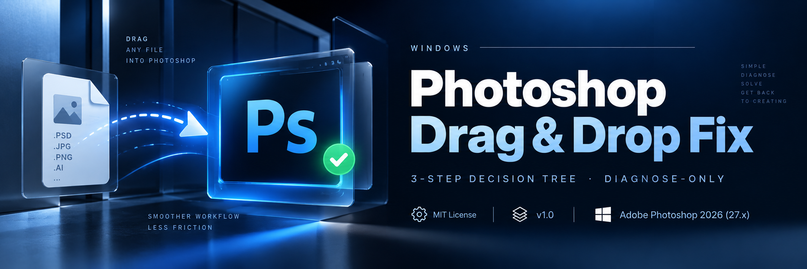

<p align="center">
  
</p>

<h1 align="center">Photoshop 拖放修复</h1>

<p align="center">
  <strong>用安全的 3 步诊断决策树,修复 Windows 10/11 上"Photoshop 拖拽文件没反应"的问题。</strong>
</p>

<p align="center">
  <sub>只诊断不修复 · 不会静默改注册表 · 不会自动重启 · 每次系统变更都要用户授权</sub>
</p>

<p align="center">
  
  
  
  <a href="./LICENSE"></a>
</p>

<p align="center">
  <a href="#这是你的问题吗">这是你的问题吗</a>
  ·
  <a href="#工作原理">工作原理</a>
  ·
  <a href="#快速开始">安装</a>
  ·
  <a href="#示例会话">示例</a>
  ·
  <a href="#证据与参考">证据</a>
  ·
  <a href="#常见问题">FAQ</a>
  ·
  <a href="./README.md">English</a>
</p>

---

## 这是你的问题吗?

本 skill 面向 Windows 上最常见的情况:**Photoshop 打开正常,但从文件资源管理器拖入文件时不再响应**。

强匹配场景:

- 之前 Photoshop 用着正常,突然拖放失效。
- JPG / PNG / TIFF 文件能正常打开,但从资源管理器拖到 PS 画布没反应。
- 你用的是 **Windows 10 或 Windows 11**,配合 **Photoshop 2026 (27.x)**。
- 你想**先诊断原因再改系统设置**。

> **不是 PS 通用修复工具**。
>
> 不修激活、崩溃、性能、缺失插件、其他 Adobe 应用等问题。

---

## 工作原理

本 skill 按"最安全、最高信号"到"破坏性更强"的顺序逐级排查。


| 步骤 | 检查项 | 为什么重要 | 变更风险 |
|---|---|---|---|
| **01 · Windows** | `EnableLUA` / UAC 状态 | Windows 完整性 / 提权行为被改动时,拖放会失效 | 低 |
| **02 · Photoshop** | PS 可执行文件 + 快捷方式提权 | 跨进程权限级别不匹配会阻断拖放 | 低 |
| **03 · 重置 + 隔离** | PS 首选项 + Windows 资源管理器 | 区分"应用状态问题"和"Windows 拖放层问题" | 中 |
| **降级** | Explorer → 记事本三方拖放测试 | 隔离"Windows 拖放整体失败"还是"PS 作为接收方失败" | 无 |

skill **每次变更前都会停下,等用户授权**。

---

## 快速开始

### 1. 安装 skill

把整个 repo 文件夹复制到你的 agent 用的 skills 目录:

| Agent | 路径 |
|---|---|
| **OpenCode / Codex / 通用** | `~/.agents/skills/photoshop-drag-drop-fix/` |
| **Claude Code** | `~/.claude/skills/photoshop-drag-drop-fix/` |
| **Cursor / 其他** | `~/.opencode/skills/photoshop-drag-drop-fix/` |

下次会话启动时自动加载。

### 2. 用自然语言描述症状

```text
Windows 11 上 Photoshop 不能拖拽。
文件能正常打开,但从资源管理器拖一张 JPG 进 PS 没反应。
先帮我诊断,不要自动改系统。
```

也可以用更短的提示:

```text
Photoshop 拖不进去图片。
```

```text
PS 不能拖文件。
```

```text
Photoshop can't drag files from Explorer.
```

---

## 示例会话

```text
你:
Photoshop 突然不能接收从资源管理器拖进来的文件了。

Agent:
我会诊断拖放路径,但不会自动改任何系统设置。

Step 1/3 — 检查 Windows UAC / EnableLUA
结果:EnableLUA = 0

找到可能的原因了。

建议的变更:
EnableLUA:0 → 1
此变更需要重启 Windows 才能生效。

应用此变更?[Yes / No]
```

最后一行是关键行为:**诊断和修复是两个独立动作**。

---

## 详细诊断

<details>
<summary><strong>01 · Windows — EnableLUA / UAC</strong></summary>

第一步检查:

```text
HKEY_LOCAL_MACHINE\SOFTWARE\Microsoft\Windows\CurrentVersion\Policies\System
EnableLUA
```

预期状态:

```text
EnableLUA = 1
```

如果值是 `0`,skill 会报告发现,并建议改为 `1`。

**不会**静默执行注册表变更。

改 `EnableLUA` 后必须重启。

Microsoft 文档确认 `EnableLUA=1` 是 UAC 默认状态,且不建议关闭。

</details>

<details>
<summary><strong>02 · Photoshop — 进程提权</strong></summary>

第二步检查 PS 是否以与文件资源管理器不同的权限级别启动。

检查位置:

- `Photoshop.exe`
- PS 快捷方式属性
- 任务栏固定快捷方式的兼容性设置
- **"以管理员身份运行此程序"**

如果 PS 被强制以管理员权限运行,而资源管理器不是,Windows 的进程完整性边界会阻止拖放。

skill 会先报告状态,再询问是否修改兼容性设置。

</details>

<details>
<summary><strong>03 · PS 首选项 + Explorer</strong></summary>

如果前两步没解释问题,skill 进入"应用状态"和"shell 状态"排查。

可能的操作:

- 启动时按 `Ctrl + Alt + Shift` 重置 PS 首选项
- 重启 Windows 资源管理器
- 重试拖放

这是**影响较高的一步**,因为重置 PS 首选项会清掉用户的自定义。

操作前先备份 PS 首选项。

</details>

<details>
<summary><strong>降级 · Explorer → 记事本隔离测试</strong></summary>

如果前三步全部通过,PS 还是收不到文件,skill 用三方拖放测试隔离故障层。

目标:判断到底是

1. Windows 拖放整体失效,还是
2. PS 单独作为接收方失败

这让排查树保持聚焦,而不是盲目升级操作。

</details>

---

## 适用范围

<table>
<tr>
<th width="50%">✅ 处理</th>
<th width="50%">❌ 不处理</th>
</tr>
<tr>
<td valign="top">

- Windows 10 / 11
- Photoshop 2026 (27.x) 桌面版
- 文件资源管理器 → PS 画布 拖放失败
- JPG / PNG / TIFF 拖放测试
- "之前能用,突然失效"的场景
- 优先诊断的工作流

</td>
<td valign="top">

- macOS
- Illustrator / InDesign / Premiere / After Effects
- PS 安装或激活
- PS 崩溃或性能调优
- 与 PS 无关的 Windows 拖放问题
- RAW / HEIF 插件或格式兼容问题

</td>
</tr>
</table>

---

## 安全模型

### 先诊断

skill 在建议修复前先检查系统状态。

### 改之前必问

它**不会**自动:

- 跑 `reg add`
- 重启 Windows
- 重启 Explorer
- 删文件
- 重置 PS 首选项

### 永远不把"关闭 UAC"当修复

skill **永远不把 `EnableLUA` 改成 `0`**。

如果检测到 `EnableLUA=0`,诊断方向是恢复**启用**默认,不是关闭更多 Windows 安全行为。

---

## 证据与参考

诊断树基于 Windows UAC 行为、Adobe 排错指南和已记录在案的社区案例。下面的参考支撑本 skill 使用的**机制与检查**;它们不能被理解为"某个根因能解释所有 Photoshop 拖放失败"的证明。

- **Microsoft Learn — EnableLUA**  
  https://learn.microsoft.com/en-us/windows-hardware/customize/desktop/unattend/microsoft-windows-lua-settings-enablelua  
  Microsoft 文档确认 `EnableLUA=true` 是默认,且不建议关闭。

- **Microsoft Learn — User Account Control settings and configuration**  
  https://learn.microsoft.com/en-us/windows/security/application-security/application-control/user-account-control/settings-and-configuration  
  文档说明 `EnableLUA` / Admin Approval Mode 及相关 UAC 策略行为。

- **Microsoft Q&A — Drag to taskbar stopped working with LUA/UAC disabled**  
  https://learn.microsoft.com/en-us/answers/questions/3917740/drag-to-taskbar-stopped-working-after-update-from  
  一个 Win11 案例:重新启用 `EnableLUA` 后拖放恢复。

- **Adobe — Troubleshoot Photoshop droplets on Windows**  
  https://helpx.adobe.com/photoshop/kb/troubleshoot-photoshop-droplets-windows.html  
  Adobe 说明:交互进程需要匹配的 UAC 权限级别。

- **Adobe Community — Unable to drag files into Photoshop CC**  
  https://community.adobe.com/t5/photoshop-ecosystem-discussions/unable-to-drag-files-into-photoshop-cc/m-p/8790295  
  一个有记录的案例:任务栏快捷方式被设成以管理员身份启动 PS,导致拖放失效。

---

## 常见问题

### Windows 11 上为什么不能拖拽文件到 Photoshop?

同一个症状可能由多种机制导致。本 skill 聚焦 3 个高信号区域:Windows UAC / `EnableLUA`、PS 进程提权、PS / Explorer 状态。

### Photoshop 拖放为什么突然失效?

Windows 策略变更、快捷方式兼容性设置、PS 首选项状态、Explorer 状态都可能改变原本能用的工作流。决策树按顺序排查这些区域,而不是盲目套修复。

### 以管理员身份运行 PS 会影响拖放吗?

会。拖拽源和放下目标的权限级别差异会影响 Windows 拖放行为。本 skill 同时检查 PS 可执行文件和快捷方式设置,而不是假设某一种启动方式。

### 什么是 EnableLUA?

`EnableLUA` 是 Windows 关联 UAC 和 Admin Approval Mode 的策略值。

默认是:

```text
EnableLUA = 1
```

本 skill 永远不推荐改成 `0`。

### 这个 skill 会自动改注册表吗?

不会。**设计上只诊断**。注册表变更、重启、首选项重置都要用户显式授权。

### 这个 skill 能在 Photoshop 2025 或更新版本上用吗?

诊断逻辑可能仍有用,但本 repo 范围限定在创建时验证过的环境:**Windows 10/11 + Photoshop 2026 (27.x)**。

未来 Adobe 或 Windows 变更可能需要更新决策树。

### macOS 能用吗?

不能。macOS 用的是完全不同的权限 / 沙箱模型,在本 skill 范围外。

---

## 触发词

<details>
<summary>应激活本 skill 的表达</summary>

```text
Photoshop 拖不进去
PS 不能拖文件
photoshop drag drop not working
can't drag image into photoshop
拖文件到 PS 没反应
photoshop can't drag
```

</details>

---

## 仓库结构

<details>
<summary>本仓库的文件</summary>

```text
photoshop-drag-drop-fix/
├── SKILL.md                  # agent 看的执行指令(3 步决策树)
├── README.md                 # English documentation
├── README.zh-CN.md           # 中文文档(本文件)
├── LICENSE                   # MIT License
├── data/
│   └── images/
│       └── banner.png        # GitHub README hero banner (1920×576)
├── prompts/
│   └── banner-versions.md    # 重新生成 banner 的 GPT Image 提示词(3 种不同风格)
├── .github/
│   └── ISSUE_TEMPLATE/
│       ├── bug_report.md     # 结构化 bug 报告
│       ├── feature_request.md
│       └── config.yml        # 禁用空白 issue,指向文档
└── (无源代码 — 纯文档 skill)
```

</details>

agent 执行细节见 **[SKILL.md](./SKILL.md)**。

---

## 🔗 相关项目

三类相近项目存在,**没有任何一个直接解决** "Windows 上 PS 拖不进文件" 这个具体问题。

### 🔌 程序化控制 Photoshop(让 agent **驱动** PS —— 不同的问题)

| 项目 | 它做什么 | 为什么不是我们 |
|---|---|---|
| [`LissaGreense/photoshop-uxp`](https://github.com/LissaGreense/photoshop-uxp) | 通过 UXP 脚本驱动 PS 的 Agent Skill | 在 PS *内部* 操作,不是修 PS *入口* 的拖放问题 |
| [`00bx/00bx-photoshop-mcp`](https://github.com/00bx/00bx-photoshop-mcp) | PS MCP server,323 个自动化工具 | 同 —— 是自动化,不是修拖放 |
| [`Vaxaxas/photoshop-mcp-windows-first`](https://github.com/Vaxaxas/photoshop-mcp-windows-first) | Windows-first 的 PS MCP | 同 |
| [`pangxie231/ps-mcp`](https://github.com/pangxie231/ps-mcp) | Photoshop MCP | 同 |

### 🪟 Windows 层拖放修复(其他 app,相同的根因)

这些项目修**其他** Windows app 的拖放,根因(EnableLUA / admin elevation)一样,但目标面不同。

| 项目 | 修什么 |
|---|---|
| [`HerMajestyDrMona/Windows11DragAndDropToTaskbarFix`](https://github.com/HerMajestyDrMona/Windows11DragAndDropToTaskbarFix) | 修 Win11 **拖到任务栏**(不是 PS) |
| Microsoft Terminal [#17291](https://github.com/microsoft/terminal/issues/17291) | 修**管理员运行的 Terminal** 拖文件(同根因) |
| Files community [#14498](https://github.com/files-community/Files/issues/14498) | 修**管理员运行的 Files** 拖放崩溃(同根因) |

### ⚠️ 错误方向的教程

一篇广泛流传的 [cnblogs 教程(2020)](https://www.cnblogs.com/Chary/articles/14139436.html) 推荐**把 `EnableLUA` 改成 0** 来修这个拖放问题。Microsoft 明确警告:这会降低系统安全,且会让 Windows 11 在**其他场景**的拖放也坏掉。本 skill **把 `EnableLUA` 改回 1**,并明确警告不要走那条错误的路。如果你的注册表因为之前的教程被改到了 0,改回 1 + 重启即可。

### 我们的差异化

| 维度 | 本 skill | 相邻项目 |
|---|---|---|
| **作用范围** | 只诊断,绝不自动修复 | 多是直接改 PS 或 Windows 的工具 |
| **方法** | 3 步排序决策 + 降级(约 80% / +12% / +5%) | 单点修复或单一工具 |
| **正确性** | `EnableLUA = 1`,**明确警告**不要设 0 | 常无方向校验 |
| **触发** | 用户说"PS 不能拖"就自动跑 | 需要手动调用 |
| **安装** | 独立 skill,拖进 skills 目录即可 | 通常绑定在大工具里 |

**用本 skill**:要修 PS 拖放(或想把这个诊断思路用在其他 Windows app)。
**用相邻项目**:要自动化 PS 工作(批处理、MCP 控制、脚本)。

---

## 适用范围说明

本 skill 只在创建时验证过的环境下测试。

以下任何一项变更都可能需要更新:

- Photoshop 主版本行为
- Windows UAC 默认值
- Windows 资源管理器拖放行为
- Adobe 进程提权行为

如果 Photoshop 28.x 或未来 Windows 版本改了拖放接收机制,在结论被视为现行前,决策树需要重新验证。

---

## 🤝 贡献

发现新的可复现根因或更好的检测路径?

欢迎提 issue 和 PR,特别欢迎:

- 有 Microsoft / Adobe 官方文档支持的新根因
- 可复现的 Windows / PS 版本特定案例
- 更好的进程提权检测方法
- 更安全的 PowerShell 诊断
- 更多的 `SKILL.md` 翻译
- 对降级隔离测试的改进

提新修复路径时,请包含:

1. 环境和版本
2. 复现步骤
3. 观察到的状态
4. 建议的诊断检查
5. 证据 / 文档
6. 是否改动系统状态

---

## 📄 许可证

**MIT 许可证** —— 自由使用、修改、分发本项目,保留许可证声明。

见 **[LICENSE](./LICENSE)**。

---

<p align="center">
  <a href="./README.md">English</a> · <strong>简体中文</strong>
</p>